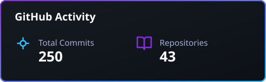

  

  
  
  
  

 

## 🚀 About Me

I'm an AI Engineer graduating in 2026, passionate about building AI-driven solutions and continuously exploring emerging technologies.
💡 I enjoy turning ideas into practical applications and learning through hands-on projects.
📫 Feel free to reach out to me through the links above I'm always happy to connect, collaborate, and discuss ideas.

---

## 🛠️ Tech Stack

### Languages

  
  
  
  
  

### Generative AI & Deep Learning

  
  
  
  
  
  

### Vision & Machine Learning

  
  
  
  

### Backend, Deployment & Cloud

  
  
  
  
  
  

---

## 📊 GitHub Analytics

  
  

 

  

